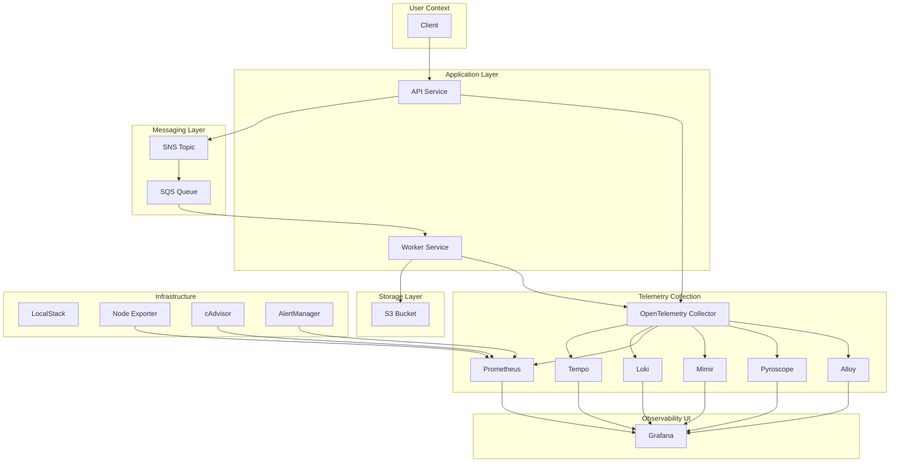

## Full-Stack Observability Platform

A comprehensive observability solution for distributed systems that demonstrates end-to-end monitoring of application telemetry including metrics, logs, traces, and profiling across multiple microservices and asynchronous message processing.

## Overview

This project implements a production-grade observability platform for monitoring distributed systems that handle asynchronous workloads. The system demonstrates how to effectively correlate telemetry signals (metrics, logs, traces, and profiles) to diagnose complex issues in a message-driven architecture where application spans cross multiple service boundaries and asynchronous messaging systems.

Modern distributed systems make troubleshooting difficult due to the fragmentation and isolation of telemetry signals across different services, containers, messaging systems, and infrastructure components. This platform addresses these challenges by providing a unified observability workflow that:

- Collects and correlates metrics, logs, traces, and profiles from application services
- Enables effective distributed trace propagation across synchronous and asynchronous boundaries
- Provides end-to-end request flow visualization from API through message queues to workers
- Offers comprehensive metrics for service and infrastructure health

## Architecture



The architecture demonstrates how all telemetry signals flow through OpenTelemetry collectors before being stored in their respective backends. Distributed traces are propagated across the SNS → SQS → Worker asynchronous messaging boundaries using OpenTelemetry's context propagation capabilities.

## Technology Stack

| Category | Technology | Purpose |
| -------- | ---------- | ------- |
| **Application** | Node.js | Application platform |
| **Observability** | OpenTelemetry | Telemetry collection and instrumentation |
| **Telemetry** | Prometheus | Metrics collection and storage |
| **Telemetry** | Loki | Log aggregation and storage |
| **Telemetry** | Tempo | Trace storage and querying |
| **Telemetry** | Pyroscope | Profiling and performance analysis |
| **Telemetry** | Mimir | Long-term metrics storage |
| **Messaging** | SNS | Publish/subscribe messaging |
| **Messaging** | SQS | Queue-based asynchronous processing |
| **Storage** | S3 | Persistent storage for processing results |
| **Cloud Simulation** | LocalStack | AWS-compatible local cloud services |
| **Containers** | Docker | Service containerization |
| **Containers** | Docker Compose | Multi-container orchestration |
| **Monitoring** | Grafana | Observability dashboards and visualization |
| **Monitoring** | Alertmanager | Alert routing and notification |
| **Infrastructure** | Node Exporter | Host-level metrics collection |
| **Infrastructure** | cAdvisor | Container metrics collection |
| **Infrastructure** | Alloy | Continuous discovery and telemetry collection |

## Observability Architecture

### Metrics

Metrics are collected from all services through OpenTelemetry instrumentation and Prometheus clients:

- **Application metrics**: HTTP request counts, durations, in-flight requests, and order processing counters
- **Infrastructure/container metrics**: Node exporter metrics for host-level monitoring and cAdvisor for container performance
- **OpenTelemetry metrics**: Automatically instrumented APIs and workers with custom metrics
- **Prometheus scraping**: Configured to scrape services at specific endpoints
- **Custom metrics**: 
  - `http_requests_total` (Counter): Total HTTP requests with `route`, `method`, and `status` labels
  - `http_request_duration_seconds` (Histogram): HTTP request latency with `route`, `method`, and `status` labels (buckets from 5ms to 5s)
  - `http_requests_in_flight` (Gauge): Current number of in-flight HTTP requests by `route`
  - `orders_published_total` (Counter): Total orders published to SQS with a `status` label (success/error)
  - `worker_jobs_processed` (Counter): Total jobs consumed from SQS and written to S3 
  - `sqs_queue_depth` (ObservableGauge): Approximate number of visible messages currently in the SQS queue
  - `sqs_messages_consumed_total` (Counter): Total SQS messages consumed and processed by the worker
  - `s3_write_duration` (Histogram): Latency of S3 PutObject operations in seconds

### Logs

Logs originate from application services and are collected via:

- **Structured logging**: Pino structured logger with trace context injection
- **Log collection**: cAdvisor and Alloy collect container logs
- **Loki**: Log aggregation and storage
- **Labels**: All logs include structured fields for trace ID, span ID, service name, and operation context
- **Correlation**: LogQL queries can correlate logs by trace ID, enabling troubleshooting through the entire request flow

### Traces

The system implements a comprehensive distributed tracing pipeline:

- **OpenTelemetry instrumentation**: Auto-instrumentation with manual spans where needed
- **Span generation**: HTTP requests, message processing, and custom spans for operations  
- **Context propagation**: Trace context is propagated through message attributes between SNS/SQS
- **Trace collection**: Tempo stores and indexes distributed traces
- **Grafana tracing**: Multi-service tracing visualizations

The implementation specifically handles SNS/SQS context propagation:
- When API service sends messages to SNS, trace context is injected into message attributes
- Worker receives messages and extracts trace context from message attributes
- Worker creates new spans that continue the trace across service boundaries

### Profiles

- **Pyroscope integration**: Continuous profiling for both API and worker services
- **Profiling source**: Node.js applications with Pyroscope agent
- **Collection**: Profile data collected and stored in Pyroscope
- **Storage**: Dedicated Pyroscope backend for profile data
- **Visualization**: Flame graphs and profile comparison in Grafana

### Alerts

The system includes:
- **Alert rules**: Configurable in Prometheus using Alertmanager
- **Alertmanager**: Routing and notification configuration
- **Conditions**: Based on metrics and service health
- **Notifications**: Webhook-based routing to alert destinations

## End-to-End Request Flow

1. **Client** → **API** (HTTP POST /orders)
2. **API** → **SNS** (Publish notification)
3. **SNS** → **SQS** (Queue message)
4. **Worker** → **SQS** (Consume message)
5. **Worker** → **S3** (Store result)

When investigating a request:
- **Metrics**: Identify service health, observed in Prometheus
- **Logs**: Trace specific operations and errors in Loki, identified by trace_id  
- **Traces**: Visualize complete request path through Tempo, span by span
- **Profiles**: Analyze CPU/memory usage during specific operations in Pyroscope

## Distributed Tracing & Context Propagation

Trace context propagation through message boundaries is implemented using OpenTelemetry's context propagation features:

### SNS/SQS Boundary Handling

- **Trace origin**: Started in API service when handling HTTP request 
- **Context injection**: Trace context is extracted from the active OpenTelemetry context and injected into message attributes
- **Transport through message**: Message attributes are stored in SNS/SQS
- **Context extraction**: Worker service extracts trace context from SQS message attributes
- **Trace continuation**: Worker creates a new `CONSUMER` span still linked to the original trace

## Telemetry Correlation

The platform enables engineers to correlate telemetry signals seamlessly:

1. **Start with metrics**: Identify anomalies in Prometheus
2. **Jump to logs**: Use trace ID to identify relevant logs in Loki  
3. **Drill into traces**: Use trace ID from logs to investigate full distributed trace in Tempo
4. **Analyze performance**: Compare traces with matching profiling data from Pyroscope
5. **Identify root cause**: All signals point to the same logical request for efficient troubleshooting

## Grafana

Grafana provides unified visibility:

- **Datasources**: Prometheus, Mimir, Loki, Tempo, and Pyroscope
- **Dashboards**: Pre-configured for service health, request flows, and performance
- **Metrics exploration**: Prometheus and Mimir data through Grafana's query interface
- **Log exploration**: Search and correlate logs via Loki with trace ID linking
- **Trace exploration**: Visualize distributed traces in Tempo with correlating context
- **Profiling**: View flame graphs from Pyroscope with direct trace correlation

## Local Development

### Prerequisites

- Docker Desktop
- Docker Compose v2.20+
- Git

### Startup

```bash
# Start all services
docker-compose up -d

# Wait for services to initialize (approx. 60 seconds)
docker-compose ps

# Verify services are healthy:
docker-compose ps
```

### Access

| Service | URL | Description |
|---------|-----|-------------|
| Grafana | http://localhost:3000 | Observability dashboard |
| Prometheus | http://localhost:9090 | Metrics platform |
| Tempo | http://localhost:3200 | Trace store |
| Loki | http://localhost:3100 | Log store |
| Pyroscope | http://localhost:4040 | Profiling service |
| LocalStack | http://localhost:4566 | AWS Local stack |
| API | http://localhost:8080 | Application API |
| Alloy | http://localhost:12345 | Alloy metrics collection |   ==> More changes will be coming in alloy

## Generating Traffic

### Send a single order:
```bash
curl -X POST http://localhost:8080/orders \
  -H "Content-Type: application/json" \
  -d '{"item":"widget", "qty": 5}'
```

### Generate multiple orders:
```bash
# Using a simple script to generate load
for i in {1..10}; do
  curl -X POST http://localhost:8080/orders \
    -H "Content-Type: application/json" \
    -d '{"item":"widget", "qty":'"$((RANDOM % 5 + 1))"'}' &
done
wait
```

### Generate sustained load:
```bash
# Run continuous order submission
while true; do
  curl -s -X POST http://localhost:8080/orders \
    -H "Content-Type: application/json" \
    -d '{"item":"gadget", "qty":3}'
  sleep 0.5
done
```

## Investigation Workflow

To troubleshoot issues using the observability platform:

1. **Start with metrics**: Open Grafana, navigate to Prometheus, and query `http_requests_total` to identify service anomalies
2. **Identify affected service**: Determine which service exhibits anomalous behavior 
3. **Inspect logs**: Use Loki to search for logs related to the service or request by trace ID
4. **Identify a trace ID**: Find messages in logs containing `trace_id` fields
5. **Open distributed trace**: In Tempo, search for the trace ID
6. **Follow full request flow**: Analyze spans to understand where time is spent and identify failures
7. **Inspect worker performance**: In Pyroscope, view profiles to check if CPU/resource usage is problematic
8. **Reproduce and fix**: Use trace data to take targeted actions for root cause identification

## Engineering Challenges & Lessons

Key engineering issues encountered and resolved during development:

### Distributed Trace Propagation
- Solved trace context propagation between SNS and SQS using OpenTelemetry message attribute injection
- Required custom message attribute handling to maintain context through AWS SDK operations

### OpenTelemetry Context Handling  
- Learned to properly use `context.with()` and `trace.getSpanContext()` for context propagation
- Fixed race conditions related to asynchronous message processing and span creation

### Metrics Not Appearing in Prometheus
- Resolved issues with metric naming and registration across services
- Addressed Prometheus scraping configuration to properly target service metrics endpoints

### Grafana Datasource Configuration
- Ensured correct mapping between service labels and observability-platform components
- Improved metric exemplar linking between Prometheus metrics and Tempo traces

### Docker Networking
- Resolved container communication issues through explicit service dependencies and Docker network configuration

### LocalStack Integration
- Addressed local AWS service compatibility issues during SNS/SQS message exchange  
- Configured proper AWS SDK endpoint configuration for localstack

## Troubleshooting

### Problem: No Metrics Appearing in Grafana
**Cause**: Prometheusr wasn't discovering the service metrics endpoints
**Solution**: Verified Prometheus scrape configurations in `prometheus.yml` and confirmed proper service port mapping

### Problem: Traces Not Showing in Tempo  
**Cause**: Trace context wasn't properly propagated from API to worker
**Solution**: Added explicit context injection and extraction in SNS/SQS message handling

### Problem: Logs Missing Trace Context
**Cause**: Custom logger wasn't capturing active trace context information
**Solution**: Enhanced logger to automatically extract and include trace information in context

## Project Structure

```
.
├── README.md                    # This file
├── docker-compose.yml           # Docker orchestration
├── api/                         # API service
│   ├── app.js
│   ├── tracing.js
│   ├── metrics.js
│   ├── server.js
│   ├── pyroscope.js  
│   └── package.json
├── worker/                      # Worker service
│   ├── worker.js
│   ├── tracing.js
│   ├── metrics.js
│   ├── profiling.js
│   └── package.json
├── shared/                      # Shared code
│   └── logger.js
├── grafana/
│   └── provisioning/
│       ├── dashboards/
│       └── datasources/
├── prometheus.yml                  # Prometheus configs
├── otel-collector/              # OpenTelemetry Collector config
│   └── config.yaml
├── alloy/                       # Grafana Alloy config
│   └── config.alloy
├── tempo.yaml                   # Tempo config
├── mimir.yaml                   # Mimir config
└── alertmanager.yml             # Alertmanager config
```

## Useful Queries

### PromQL
- `http_requests_total` - Total HTTP requests by service
- `orders_published_total` - Order publishing success/failure rates  
- `worker_jobs_processed` - Worker job processing counts
- `sqs_queue_depth` - Current queue depth of messages
- `s3_write_duration` - S3 write operation latencies

### LogQL
- `{service="api"} | trace_id="abc123"` - Filter logs by service and trace ID
- `{service="worker"} | level="error"` - Find errors from worker service
- `{service="api"} | order_id="xyz789"` - Find logs by order ID

### Trace Investigation
1. In Tempo UI, search by `trace_id` field
2. Use linked trace ID from logs in Loki
3. Search traces with service filter in Tempo UI

### Profiling
1. In Grafana, navigate to Pyroscope dashboard
2. Select service by name (`api` or `worker`)
3. Apply time range filters to investigate specific periods
4. Use flame graphs to identify hotspots

## Design Decisions

### Why OpenTelemetry?
Designed for modern, cross-language observational tools and provides industry-standard APIs integrating well with existing tools in the ecosystem.

### Why Prometheus?
Chosen for efficient gathering, storing, and querying of time-series metrics with alerting capabilities via Alertmanager.

### Why Loki?
Selected for efficient log aggregation with powerful query interface and tight integration with Grafana.

### Why Tempo?
Used for distributing traces with efficient storage and ability to correlate with other telemetry.

### Why Pyroscope?
Implemented for continuous profiling of application performance to debug CPU and memory usage.

### Why LocalStack?
Implemented to simulate AWS services locally, avoiding out-of-process dependencies during development.

### Why Asynchronous Messaging?
Demonstrates implementation of distributed tracing across asynchronous message boundaries, which is a common and challenging pattern in modern systems.

## Future Improvements

**Future / Not Yet Implemented**

- Kubernetes-based deployment instead of Docker Compose
- Cloud-native deployments on AWS/Azure/GCP
- Service-level dashboards with defined service level indicators (SLIs) 
- Alerting based on error budgets and burn rate
- Advanced load testing scenarios
- eBPF-based system-level observability
- Chaos engineering integration with custom scenarios
- Automated incident investigation AI capabilities
- SLO-driven alerting based on service level objectives
- Advanced trace analysis and root cause detection capabilities